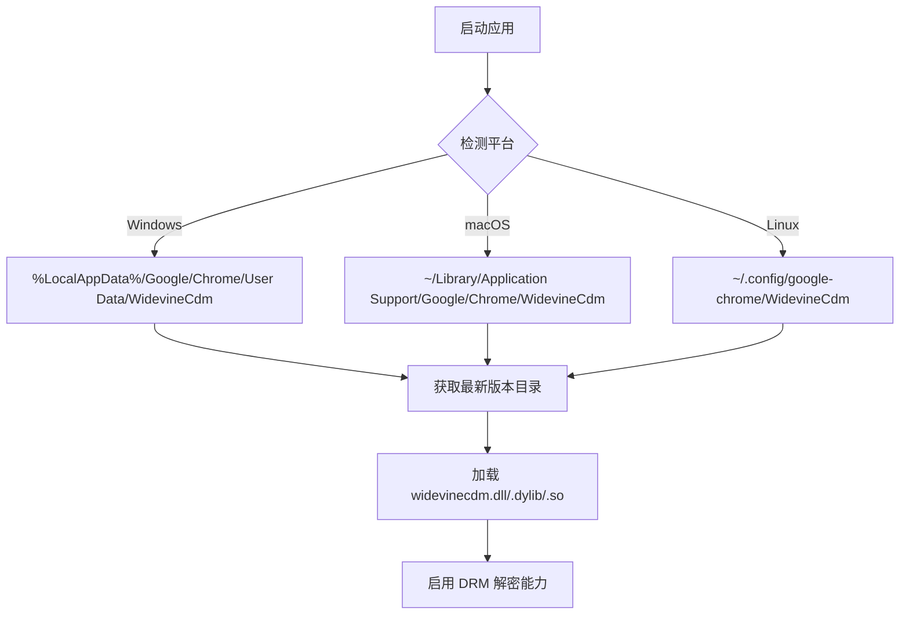
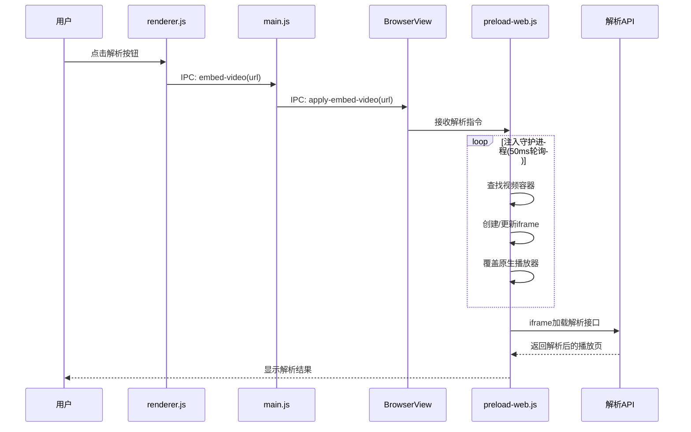
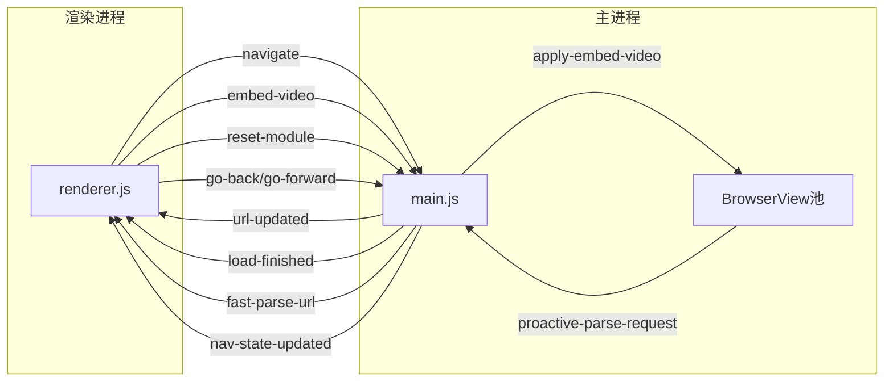
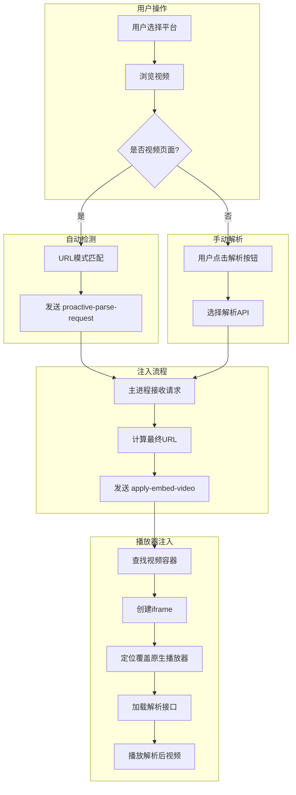

# AudioVisual 项目架构深度分析报告

## 项目概述

**AudioVisual** 是一款基于 Electron 构建的跨平台视频解析播放器，定位为"解锁所有视频流媒体的钥匙"。该应用采用独特的 BrowserView 多窗口架构，实现了国内主流视频平台（腾讯、爱奇艺、优酷、芒果TV、哔哩哔哩）的视频解析功能，同时集成了海外影视资源导航模式。

| 属性 | 详情 |
|------|------|
| 版本 | 1.1.0 |
| 主技术栈 | Electron 33.x + 原生 JavaScript |
| 代码规模 | 约 4,500 行（不含第三方库） |
| 支持平台 | Windows x64 / macOS (x64, arm64) / Linux x64 |
| 许可证 | UNLICENSED（私有项目） |

---

## 目录结构

```
AudioVisual/
├── main.js                    # 主进程入口 (961行)
├── index.html                 # 主界面HTML (423行)
├── package.json               # 项目配置
├── assets/
│   ├── css/
│   │   ├── style.css          # 主样式 (1368行)
│   │   ├── drama-style.css    # 影视模式主题 (137行)
│   │   ├── view-style.css     # BrowserView样式注入 (22行)
│   │   └── toastify.min.css   # Toast提示库
│   ├── js/
│   │   ├── renderer.js        # 渲染进程逻辑 (876行)
│   │   ├── preload-ui.js      # UI预加载脚本 (48行)
│   │   ├── preload-web.js     # 网页预加载脚本 (442行)
│   │   └── toastify.min.js    # Toast库
│   ├── fonts/                 # HarmonyOS字体
│   └── images/                # 图标资源
├── userData/                  # 运行时数据目录
└── dist/                      # 打包输出目录
```

---

## 一、软件架构与技术栈

### 1.1 技术栈概览

```
┌─────────────────────────────────────────────────────────────┐
│                      AudioVisual 架构                        │
├─────────────────────────────────────────────────────────────┤
│  渲染层    │  index.html + renderer.js + style.css          │
│            │  └── Electron BrowserWindow (UI容器)            │
├────────────┼────────────────────────────────────────────────┤
│  桥接层    │  preload-ui.js (contextBridge API)              │
│            │  preload-web.js (网页注入脚本)                   │
├────────────┼────────────────────────────────────────────────┤
│  主进程    │  main.js                                       │
│            │  ├── BrowserView 池化管理                       │
│            │  ├── IPC 通信路由                               │
│            │  ├── 自动更新机制                               │
│            │  └── Widevine CDM 注入                          │
├────────────┼────────────────────────────────────────────────┤
│  运行时    │  Electron 33.x + Chromium + Node.js            │
└─────────────────────────────────────────────────────────────┘
```

### 1.2 核心依赖分析

| 依赖 | 版本 | 用途 |
|------|------|------|
| `electron` | ^33.0.0 | 主框架 |
| `electron-builder` | ^25.1.8 | 打包工具 |
| `electron-updater` | ^6.6.2 | 自动更新 |
| `electron-log` | ^5.2.4 | 日志记录 |
| `axios` | ^1.4.0 | HTTP请求（更新检查） |

### 1.3 Electron 配置关键点

```javascript
// main.js 核心配置
app.commandLine.appendSwitch('disable-blink-features', 'AutomationControlled');  // 反自动化检测
app.commandLine.appendSwitch('no-proxy-server');                                  // 禁用代理
app.commandLine.appendSwitch('disable-features', 'CalculateNativeWinOcclusion'); // Windows白屏修复
```

### 1.4 Widevine CDM 注入机制

项目通过动态检测本地 Chrome 安装路径，自动加载 Widevine DRM 模块：



---

## 二、核心业务逻辑

### 2.1 视频解析处理流程



### 2.2 BrowserView 池化管理机制

项目实现了创新的 **ViewPool** 预渲染架构：

```javascript
// 核心数据结构
const viewPool = new Map();  // URL -> BrowserView 映射

// 预渲染站点列表
const platformHomePages = [
  'https://v.qq.com',
  'https://www.iqiyi.com',
  'https://www.youku.com',
  'https://www.bilibili.com',
  'https://www.mgtv.com'
];

const dramaSites = [
  { url: 'https://monkey-flix.com/', name: '猴影工坊', timeout: 15000, retry: 2 },
  { url: 'https://www.movie1080.xyz/', name: '影巢movie', timeout: 20000, retry: 3 },
  // ...
];
```

**预渲染策略：**

| 策略 | 说明 |
|------|------|
| 后台预加载 | 应用启动100ms后开始后台预渲染所有站点 |
| 超时重试 | 每个站点配置独立超时和重试次数 |
| 缓存复用 | 导航时优先使用缓存View，无缓存才创建 |
| 会话缓存 | 24小时有效期，过期自动清理 |

### 2.3 IPC 通信架构



**IPC 通道列表：**

| 通道 | 方向 | 用途 |
|------|------|------|
| `navigate` | 渲染->主 | 导航到指定URL |
| `embed-video` | 渲染->主 | 触发视频解析 |
| `reset-module` | 渲染->主 | 重置模块到首页 |
| `apply-embed-video` | 主->View | 向网页注入解析器 |
| `fast-parse-url` | 主->渲染 | 快速解析触发 |
| `proactive-parse-request` | View->主 | 主动解析请求 |

### 2.4 配置文件格式与存储

**用户配置：**
- 存储位置：`localStorage`
- 配置项：解析API列表、影视站点列表
- 格式：JSON序列化

**窗口状态：**
- 存储位置：`userData/window-state.json`
- 内容：窗口位置、大小、侧边栏状态

**缓存状态：**
- 存储位置：`userData/cache_info.json`
- 用途：预渲染缓存有效性检查

---

## 三、Windows 11 适配情况

### 3.1 系统依赖检查

| 依赖项 | 检测方式 | 处理策略 |
|--------|----------|----------|
| Widevine CDM | 路径扫描 | 自动检测Chrome安装路径 |
| Chrome浏览器 | 非必需 | 仅用于获取CDM模块 |

### 3.2 路径处理方式

```javascript
// Windows 路径处理
const widevinePath = `${os.homedir()}/AppData/Local/Google/Chrome/User Data/WidevineCdm`;

// 用户数据路径（强制覆盖默认）
app.setPath('userData', path.join(__dirname, 'userData'));
```

### 3.3 多线程/多进程模型

```
┌─────────────────────────────────────────────────┐
│              AudioVisual 进程模型               │
├─────────────────────────────────────────────────┤
│  主进程 (Node.js)                               │
│  └── 职责：窗口管理、IPC路由、预渲染调度          │
├─────────────────────────────────────────────────┤
│  UI渲染进程 (Chromium)                          │
│  └── 职责：用户界面交互、侧边栏控制               │
├─────────────────────────────────────────────────┤
│  BrowserView 进程 (多个，按需创建)               │
│  ├── View-腾讯视频                              │
│  ├── View-爱奇艺                                │
│  ├── View-芒果TV                                │
│  └── ...                                        │
└─────────────────────────────────────────────────┘
```

### 3.4 窗口管理机制

- **无边框窗口**：`frame: false, titleBarStyle: 'hidden'`
- **自定义标题栏**：支持最小化、最大化、关闭
- **窗口状态持久化**：自动保存/恢复窗口位置和大小
- **全屏模式支持**：动态调整BrowserView边界

---

## 四、当前已知的缺陷与风险

### 4.1 性能瓶颈分析

#### 问题1：影巢模块加载慢

**现象描述：**
`movie1080.xyz` 配置了 20秒超时和 3次重试，是所有站点中超时最长的。

**根因分析：**
1. 目标站点服务器响应慢（海外服务器）
2. 站点存在大量第三方追踪脚本
3. 网络环境限制

**缓解措施（已实现）：**
```javascript
// DramaSiteOptimizer 模块
blockUnnecessaryResources() {
  const blockedDomains = [
    'google-analytics', 'googletagmanager', 'facebook.com', 'doubleclick',
    'adservice', 'ads.', 'analytics.', 'tracking.', 'pixel.'
  ];
  // 拦截脚本注入
}
```

#### 问题2：注入守护进程高频轮询

**现象：** 50ms 超高频探测可能造成CPU占用

**优化建议：**
- 5秒后降低频率至 250ms（已实现）
- 可考虑使用 MutationObserver 替代部分轮询

### 4.2 内存泄漏风险

| 风险点 | 描述 | 严重程度 |
|--------|------|----------|
| ViewPool 无限增长 | 缓存View未设置上限 | 高 |
| 事件监听器累积 | 每次导航可能重复绑定事件 | 中 |
| iframe 未销毁 | 解析iframe可能残留 | 中 |

### 4.3 代码质量问题

| 问题 | 位置 | 说明 |
|------|------|------|
| 魔法数字 | 多处 | `50ms`, `200ms`, `15000ms` 等未定义为常量 |
| 重复代码 | main.js | `navigate` 和 `reset-module` 处理逻辑高度相似 |
| 过长函数 | main.js | `createWindow()` 约 300 行 |
| 硬编码配置 | preload-web.js | 广告拦截选择器列表硬编码 |

### 4.4 安全风险

| 风险 | 描述 | 建议 |
|------|------|------|
| webSecurity: false | 禁用Web安全策略 | 仅用于必要场景，应限定范围 |
| CSP删除 | 移除了内容安全策略头 | 可能导致XSS风险 |

---

## 五、运行环境配置

### 5.1 构建工具

```json
// package.json build 配置
{
  "build": {
    "appId": "com.void.player",
    "compression": "maximum",
    "electronDownload": {
      "mirror": "https://npmmirror.com/mirrors/electron/"
    }
  }
}
```

### 5.2 打包配置

| 平台 | 目标格式 | 架构 |
|------|----------|------|
| Windows | NSIS安装包 | x64 |
| macOS | DMG | x64, arm64 |
| Linux | DEB | x64 |

### 5.3 运行权限要求

- **Windows**: `requestedExecutionLevel: "asInvoker"`（无需管理员权限）
- **网络**: 需要访问外网（解析API、影视站点）
- **本地存储**: 需要 Chrome 浏览器安装（用于 Widevine CDM）

---

## 六、音视频处理流程图



---

## 七、针对性的优化建议

### 7.1 性能优化

| 优化项 | 当前状态 | 建议方案 | 预期收益 |
|--------|----------|----------|----------|
| ViewPool上限 | 无限制 | 设置最大缓存数(如10个)，LRU淘汰 | 防止内存溢出 |
| 注入轮询频率 | 50ms固定 | 采用自适应频率(成功后降频) | 降低CPU占用 |
| 预渲染时机 | 启动后100ms | 延迟到窗口显示后 | 提升启动速度 |
| 广告拦截 | 运行时拦截 | 预编译规则+Request拦截 | 提升页面加载速度 |

### 7.2 代码质量优化

```javascript
// 建议：提取常量配置
const CONFIG = {
  INJECTION_INTERVAL_FAST: 50,
  INJECTION_INTERVAL_SLOW: 250,
  INJECTION_SLOW_DOWN_THRESHOLD: 5000,
  PRELOAD_DELAY: 100,
  DEFAULT_TIMEOUT: 15000,
  CACHE_VALIDITY_HOURS: 24
};
```

### 7.3 架构改进建议

```
建议重构方向：

1. 分离关注点
   - 将 BrowserView 管理独立为 ViewPoolManager 类
   - 将自动更新独立为 AutoUpdater 模块
   - 将 IPC 处理独立为 IpcRouter

2. 引入状态管理
   - 使用简单的事件发射器模式管理应用状态
   - 避免全局变量

3. 配置外部化
   - 将 dramaSites、platforms 等配置移至外部JSON文件
   - 支持运行时热更新
```

---

## 八、总结

AudioVisual 是一个技术实现较为完整的 Electron 视频解析应用，其创新的 BrowserView 池化预渲染架构为多站点切换提供了良好的用户体验。

**优势：**
- BrowserView 池化架构实现快速站点切换
- 主动式解析检测减少用户等待时间
- 多平台兼容性好
- 自动更新机制完善

**待改进：**
- ViewPool 内存管理需要上限控制
- 注入守护进程可进一步优化
- 部分硬编码配置需要外部化
- 安全策略需要更精细的控制

---

*报告生成时间：2026-04-11*
*分析工具：MonkeyCode AI*
